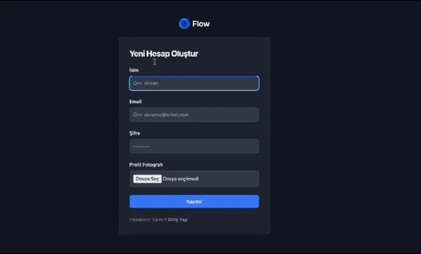

<h1>Forum App</h1>

This project is a forum application developed using various libraries such as React, React Router, json-server, react-icons, react-toastify, uuid, axios, moment, and tailwindcss.

## Features

- Users can create new accounts and log into existing ones.
- Posts can be categorized and viewed accordingly.
- Users can create posts and comment on them.
- Profile editing and password updating functionalities are available.
- Users can delete their own posts.
- The user interface is designed to be modern and responsive using Tailwindcss.

## Used Libraries

- [React](https://reactjs.org/)
- [React Router](https://reactrouter.com/)
- [json-server](https://github.com/typicode/json-server)
- [react-icons](https://react-icons.github.io/react-icons/)
- [react-toastify](https://fkhadra.github.io/react-toastify/)
- [uuid](https://www.npmjs.com/package/uuid)
- [axios](https://axios-http.com/)
- [moment](https://momentjs.com/)
- [tailwindcss](https://tailwindcss.com/)

<h3>Screenshot</h3>

